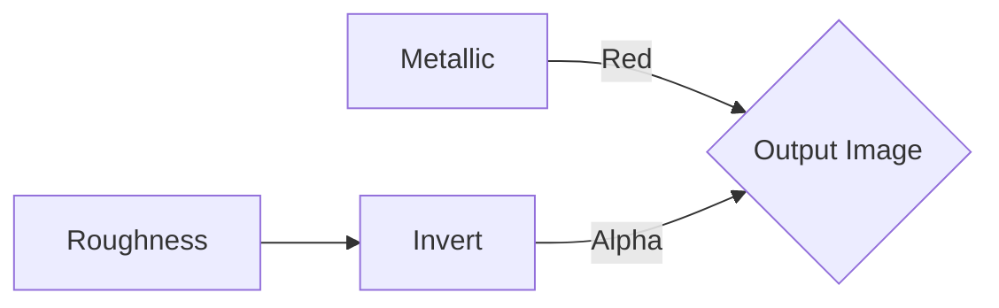
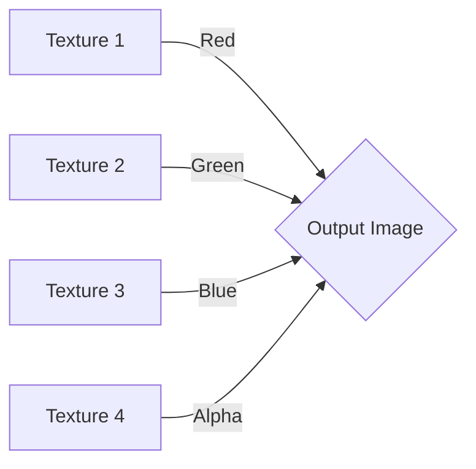
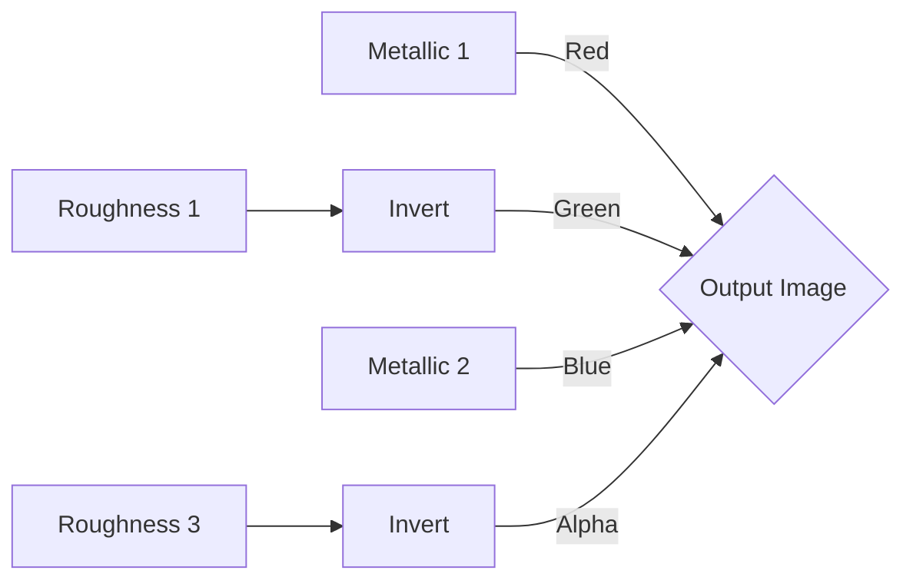
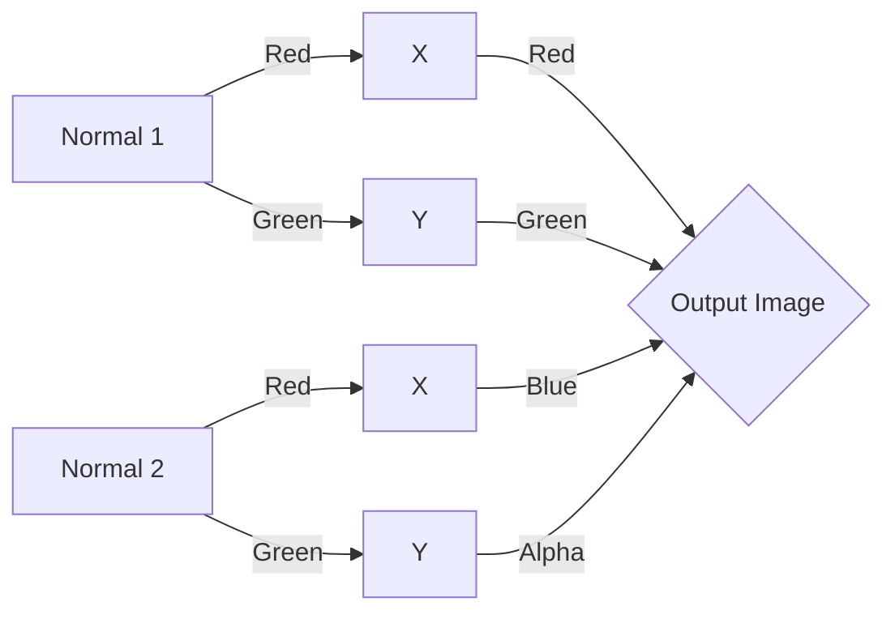
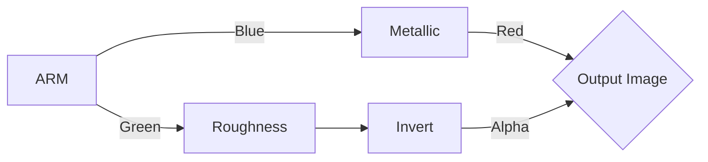
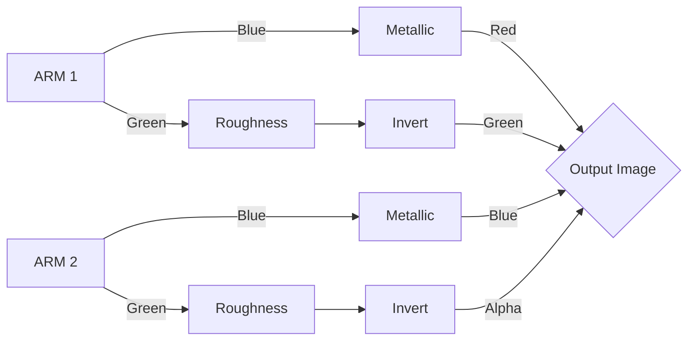
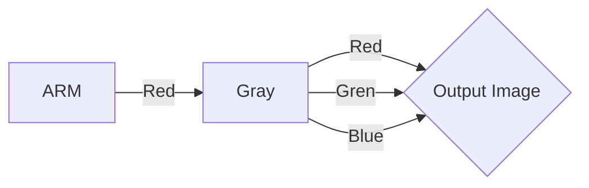

# PBS Texture Merger
## Introduction
This project serves as a versatile tool for game developers and artists working with Unity's Standard Shader particularly within the context of Resonite's Physically-Based Shading (PBS) Metallic Materials. It streamlines the process of merging various textures from different materials. The tool also facilitates the creation of composite textures suitable for use with Resonite's Color Splat Materials.

## Metallic Smooth Map

This method creates an output image specifically for the Metallic workflow in Unity's Standard Shader. It uses the red channel to carry the metallic map and the alpha channel to hold the inverted roughness map, which defines the smoothness. The roughness texture is first inverted before being placed into the alpha channel of the output image.

## Color Splat

The Color Splat method combines up to four different textures into one output image by mapping each texture to a separate color channel. Texture 1 is mapped to the red channel, Texture 2 to the green channel, Texture 3 to the blue channel, and Texture 4 to the alpha channel. This technique is typically used for creating complex terrains by blending different textures based on these color channels.

## Color Splat Metallic Map

This variant of the Color Splat method is used for combining metallic and roughness textures from two different materials into a single output image. Metallic 1 and Metallic 2 textures are assigned to the red and blue channels, respectively. Roughness 1 and Roughness 3 are inverted and then assigned to the green and alpha channels of the output image.

## Color Splat Normal Map

For normal maps, this approach involves separating the normal information of two textures into their respective red and green channels and then recombining them into one output image. Normal 1's red and green channels are mapped to the output image's red and green channels, respectively, while Normal 2's red and green channels are remapped to the output image's blue and alpha channels.

## ARM to Metallic Smooth Map

In the ARM to Metallic Smooth Map conversion, an ARM texture, which contains Ambient Occlusion, Roughness, and Metallic information, is split so that the metallic information (from the blue channel) is used for the output image's red channel, and the roughness information (from the green channel) is inverted and used for the alpha channel. This produces a texture suitable for the Metallic workflow in Unity where the smoothness information is stored in the alpha channel of the metallic map.

## ARM to Metallic Smooth Map Combined

In this method, two ARM textures are combined into a single output image suitable for metallic workflows. From ARM 1, the metallic data is taken from the blue channel and mapped to the red channel of the output image, while the roughness data from the green channel is inverted and transferred to the output image's green channel. For ARM 2, the metallic data is again taken from the blue channel but this time is directed to the output image's blue channel. The roughness from ARM 2's green channel is inverted and assigned to the alpha channel of the output image. This technique creates a composite image where each color channel and the alpha channel are used to represent metallic and smoothness information from two different sources.

## ARM to Ambient Occlusion Map

This conversion extracts the Ambient Occlusion information from the red channel of an ARM texture and converts it into a grayscale image that serves as the Ambient Occlusion map.

## License
MIT License

Copyright (c) 2023 Rixx