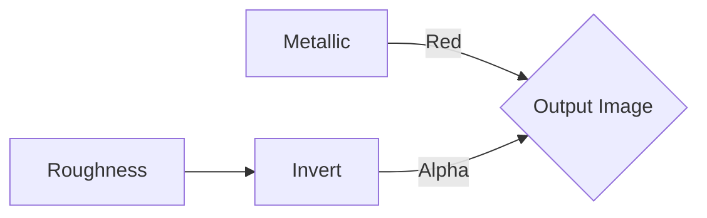
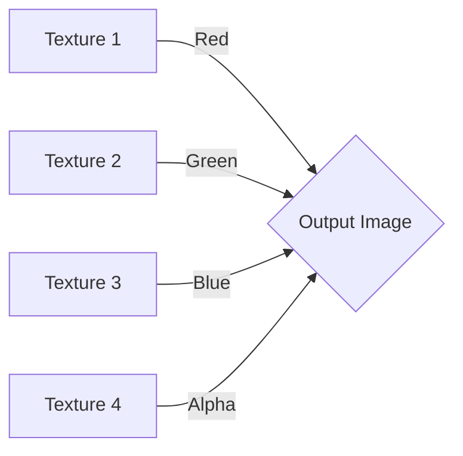
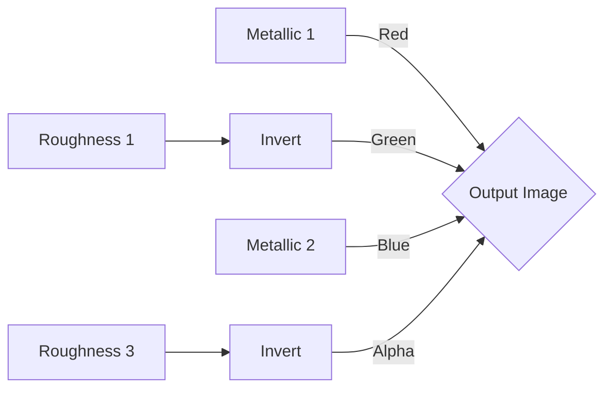
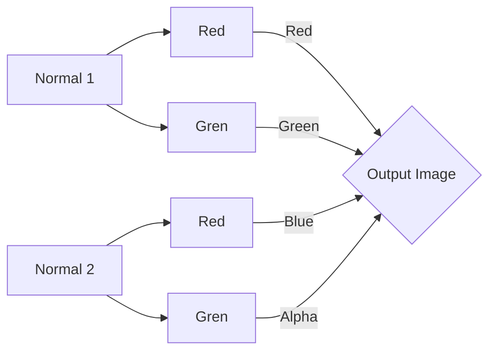

# PBS Image Texture Combiner
## Introduction
This project serves as a versatile tool for game developers and artists working with Unity's Standard Shader particularly within the context of Resonite's Physically-Based Shading (PBS) Metallic Materials. It streamlines the process of merging various textures from different materials. The tool also facilitates the creation of composite textures suitable for use with Resonite's Color Splat Materials.

## Metallic Smooth Map

## Color Splat

## Color Splat Metallic Map

## Color Splat Normal Map

## License
MIT License

Copyright (c) 2023 Rixx